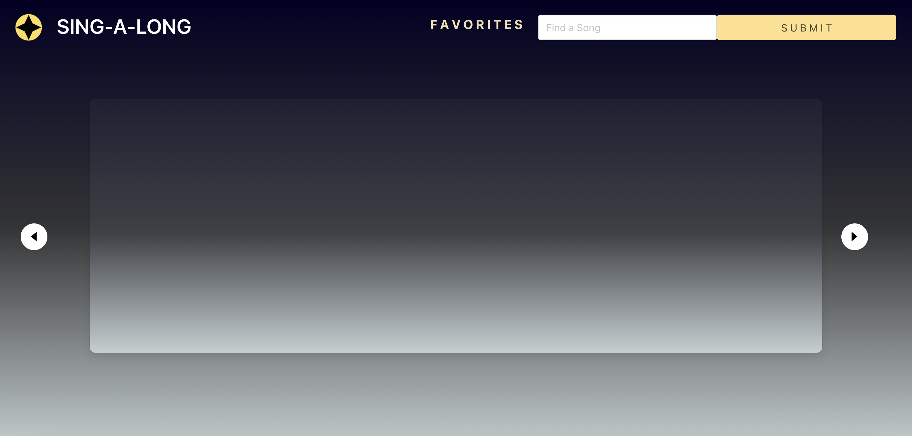
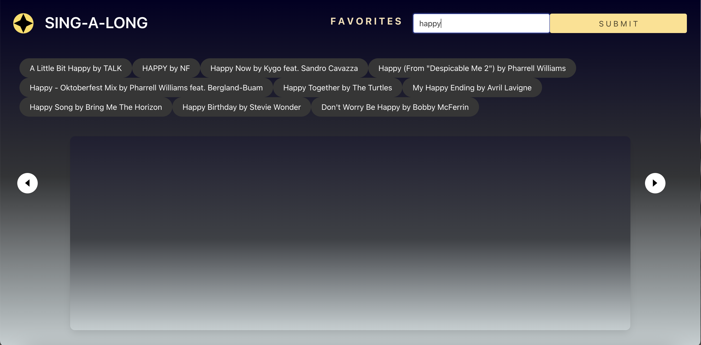
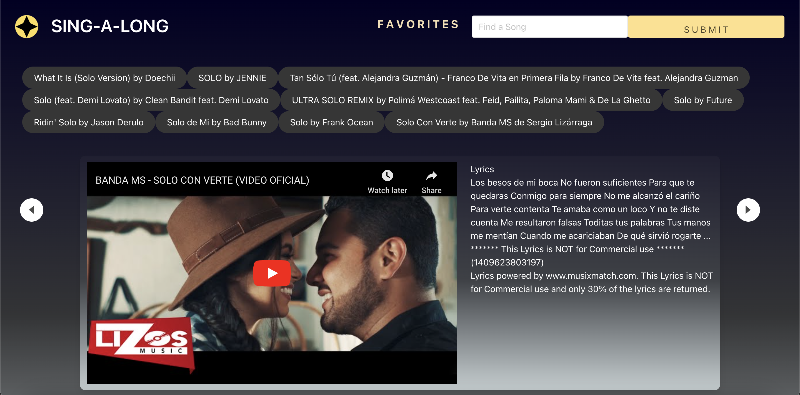
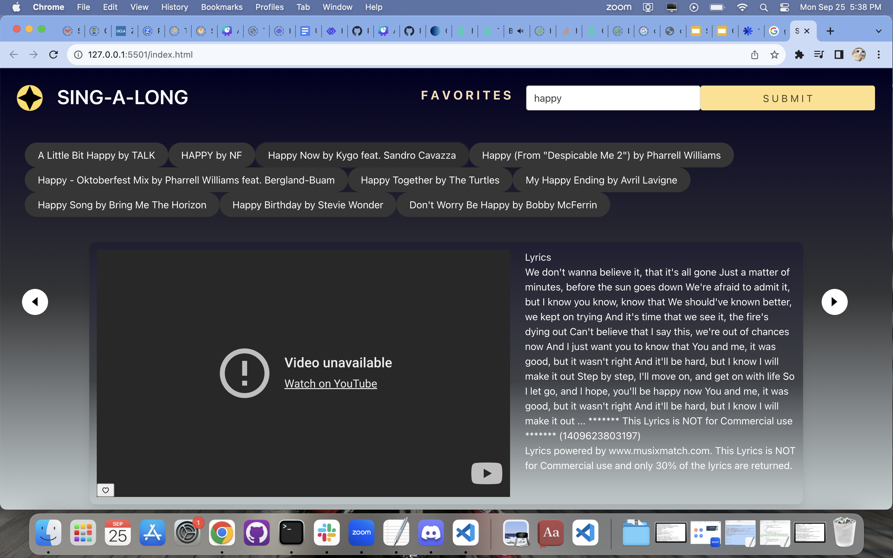

# Singalong

Singalong is an interactive karaoke website which utilizes MusixMatch API and YouTube API to populate user requested video of song and lyrics to sing along to. Users can also favorite their favorite songs and view them in the favorites tab.

Link to site: [https://adamywfong.github.io/singalong/](https://adamywfong.github.io/singalong/)

## Installation

This webpage will be loaded, but Node.js might be required if user does not have it installed already to initialize bulma plugin.

## Usage
This is the webpage displayed at full screen, a blank landing page that can be populated through the search bar in the upper right corner.  

If we input a search term, results will populate on the page in the form of buttons which can be selected.

Once a button is selected, it will populate in the carousel! Bonus-feature: this website can also provide non-english song and lyrics as well.
    

However,not all songs are available through YouTube API and can only be watched on their site. 

Additionally, we have implemented a favorite buttons feature. When set to active, this will allow the song to be added to the user's "Favorites" page. 

The Favorites page will display a list of the user's favorite songs!

## License

[MIT](https://choosealicense.com/licenses/mit/)

## Credit
Members of Team Karaoke!
