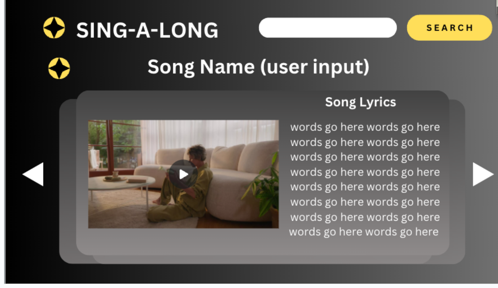

# singalong
Singalong - Best Karaoke Page Ever!

Singalong is a web application that allows users to enjoy karaoke-style music and lyrics. Users can search for their favorite songs, view lyrics, and sing along to their chosen tracks. The project incorporates a colorful design and an image carousel to enhance the user experience.

Table of Contents
Features
Prerequisites
Getting Started
Usage
APIs
Contributing
License
Features
Search for songs and view their lyrics.
Enjoy a visually appealing design with unicorn-themed colors.
Sing along to music while viewing lyrics.
Navigate through images with an interactive image carousel.
Automatic slideshow feature in the image carousel.
Prerequisites
Before you begin, ensure you have met the following requirements:

A modern web browser that supports HTML5, CSS3, and JavaScript.
Internet access to fetch song lyrics and music videos.
Node.js (optional) if you want to use a development server.
Getting Started
To get started with this project, follow these steps:

Clone the repository to your local machine:

bash
Copy code
git clone https://github.com/your-username/singalong.git
Navigate to the project directory:

bash
Copy code
cd singalong
If you have Node.js installed, you can use a development server like "lite-server" or "http-server" to run the project locally. Otherwise, simply open the index.html file in your web browser.

Usage
Open the project in a web browser.
Use the search bar to look for your favorite songs.
Click on a search result to view the song's lyrics and start singing along.
Enjoy the visually appealing unicorn-themed design and the interactive image carousel.
APIs
The project uses the following APIs:

Musixmatch API for song search and lyrics retrieval.
YouTube API for embedding and playing music videos.
Make sure to obtain your API keys and configure them in the JavaScript code if you plan to deploy this project.

Contributing
Contributions are welcome! If you'd like to contribute to this project, please follow these steps:

Fork the repository on GitHub.
Clone your forked repository to your local machine.
Create a new branch for your feature or bug fix.
Make changes and commit them to your branch.
Push your changes to your fork on GitHub.
Create a pull request to merge your changes into the main project.
Please follow the project's coding style and guidelines when making contributions.

License
This project is licensed under the MIT License - see the LICENSE file for details.

